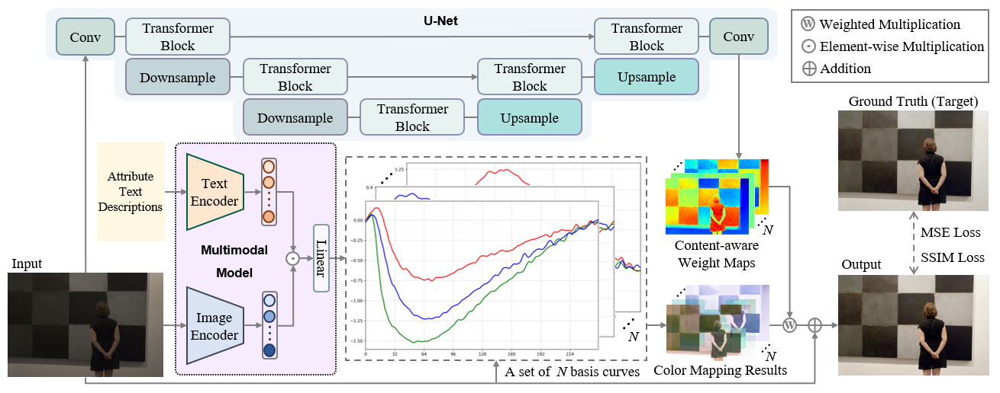

# The official implementation of the paper "CA-ATP: Content-Adaptive Image Retouching Guided by Attribute-Based Text Representation".


## Abstract

> Image retouching has garnered significant attention due to its ability to achieve professional-level visual enhancement. Existing approaches mainly rely on uniform pixel-wise color mapping across entire images, neglecting the inherent color variations induced by image content. This limitation consequently hinders existing approaches from achieving adaptive retouching that accommodates both diverse color distributions and user-defined style preferences. To address these challenges, we propose a novel Content-Adaptive image retouching method guided by Attribute-based Text Representation (CA-ATP). Specifically, we propose a content-adaptive curve mapping module, which leverages a series of basis curves to establish multiple color mapping relationships and learns the corresponding weight maps, enabling content-aware color adjustments. The proposed module can capture color diversity within the image content, allowing identical color values to receive distinct transformations based on their spatial context. In addition, we propose an attribute text prediction module that generates text representations from multiple image attributes to quantitatively represent user-defined style preferences. These attribute-based text representations are subsequently integrated with visual features via a multimodal model, guiding image retouching to align with user preferences. Extensive experiments on several public datasets demonstrate that our method achieves state-of-the-art performance. Our source code can be found in the supplementary material.



## Getting started

### Install

We test the code on Python 3.12.5 + PyTorch 2.4.1 + CUDA 12.1, and close versions also work fine.

- Install PyTorch and torchvision fom [http://pytorch.org](http://pytorch.org).
- Install other requirements:

```sh
pip install -r requirements.txt
```

We mainly train the model on RTX 3090.

### Download

We use two datasets in this paper: [MIT-Adobe FiveK](https://data.csail.mit.edu/graphics/fivek/) and [PPR10K](https://github.com/csjliang/PPR10K)

Our pretrained models are available here: [Google Drive](https://drive.usercontent.google.com/download?id=1R3GyJi0DLNllCGulXqyDRYgItSOOCbnB)

The CLIP pretrained models can be found here: [CLIP](https://github.com/openai/CLIP/tree/main)

The image attribute evaluation program we used can be obtained from: [ACfeatures](http://www.cristinasegalin.com/research/projects/phd/personality/ACfeatures.zip). After normalization, you can obtain style vectors that are consistent with those in our `style data` directory.

The final file path should match the following structure: 

```
┬─ model
│   └─ paper/enhancer_psnr_avg.pth
├─ clip_model
│   ├─ ViT-L-14-336px.pt
│   └─ ... (Pretrained CLIP models)
└─ data
    ├─ train
    │   ├─ 01-Experts-A
    │   │   ├─ a0001.jpg
    │   │   └─ ... (id.jpg)
    │   └─ ... (style folder)
    │   └─ ... (style folder)
    └─ test
        └─ ... (style folder)
```

### Test

Just run:

```sh
python test.py
```

You can verify whether the program runs correctly and obtain retouched results similar to those shown in the paper by executing the following command:

```sh
python test.py --data_dir demo
```

You can control `gt_styles ` to achieve the corresponding styles. For example, the parameter `01-Experts-A ` corresponds to the style of Expert A, and `03-Experts-C` corresponds to the style of Expert C.